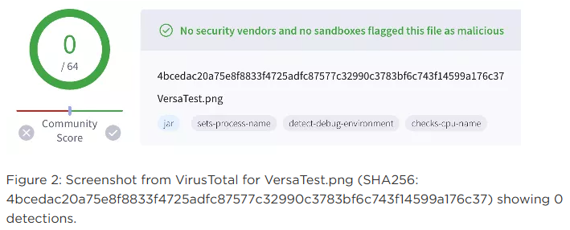
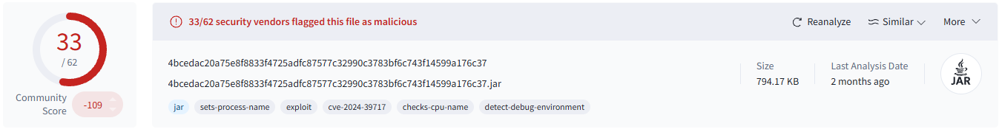
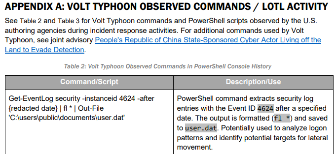

# ElectricBreeze-1

Find the Sherlock [here.](https://app.hackthebox.com/sherlocks/ElectricBreeze-1?tab=play_sherlock)

|Difficulty|     Category      |
|:--------:|:-----------------:|
|Very Easy |Threat Intelligence|

**Skills learned:**
* Researching active APT groups
* Mapping adversary behavior using the MITRE framework

## Description
Your security team must always be up-to-date and aware of the threats targeting organizations in your industry. As you begin your journey as a Threat Intelligence Intern, equipped with some SOC experience, your manager has assigned you a task to test your research skills and how effectively you can leverage the MITRE ATT&CK framework.

Conduct thorough research on Volt Typhoon.
Use the MITRE ATT&CK framework to map adversary behavior and tactics into actionable insights.
Impress your manager with your assessment, showcasing your passion for threat intelligence.

## Questions
**1. Based on MITRE's sources, since when has Volt Typhoon been active?**

MITRE's [documentation](https://attack.mitre.org/groups/G1017/) on the Volt Typhoon group mentions how long they have been active.

```text
"Volt Typhoon is a People's Republic of China (PRC) state-sponsored actor that has been active since at least 2021..."
```

**Answer: 2021**

---

**2. MITRE identifies two OS credential dumping techniques used by Volt Typhoon. One is LSASS Memory access (T1003.001). What is the Attack ID for the other technique?**

The techniques used by this group can also be found in MITRE's group [documentation](https://attack.mitre.org/groups/G1017/), under the section **Techniques Used**. Looking for *OS Credential Dumping* techniques, we see two results.

```text
Enterprise	T1003	.001	OS Credential Dumping: LSASS Memory	
Volt Typhoon has attempted to access hashed credentials from the LSASS process memory space.[2][1]

.003	OS Credential Dumping: NTDS	
Volt Typhoon has used ntds.util to create domain controller installation media containing usernames and password hashes.
```

**Answer: T1003.003**

---

**3. Which database is targeted by the credential dumping technique mentioned earlier?**

Looking into [T1003.003](https://attack.mitre.org/techniques/T1003/003/) further, we see that this sub-technique targets Active Directory:

```text
"Adversaries may attempt to access or create a copy of the Active Directory domain database in order to steal credential information, as well as obtain other information about domain members such as devices, users, and access rights."
```

**Answer: Active Directory**

---

**4. Which registry hive is required by the threat actor to decrypt the targeted database?**

In order to decrypt the data inside the `ntds.dit` database, the host's **Boot Key** is required. The Boot Key is stored in the *HKLM\SYSTEM* registry hive.

**Answer: SYSTEM**

---

**5. During the June 2024 campaign, an adversary was observed using a Zero-Day Exploitation targeting Versa Director. What is the name of the Software/Malware that was used?**

MITRE's [documentation](https://attack.mitre.org/groups/G1017/) on the Volt Typhoon group includes data on their campaigns under the **Campaigns** section. The campaign first seen in June 2024 is **C0039:Versa Director Zero Day Exploitation**.

Investigating [campaign C0039](https://attack.mitre.org/campaigns/C0039/), we can see the software/malware used is listed in the **Software** section.

```text
S1154	VersaMem	
VersaMem was used during Versa Director Zero Day Exploitation by Volt Typhoon.
```

**Answer: VersaMem**

---

**6. According to the Server Software Component, what type of malware was observed?**

Investigating [software S1154](https://attack.mitre.org/software/S1154/) further, we can see that it is a *web shell*.

```text
VersaMem is a web shell designed for deployment to Versa Director servers following exploitation. Discovered in August 2024, VersaMem was used during Versa Director Zero Day Exploitation by Volt Typhoon to target ISPs and MSPs.
```

**Answer: Web shell**

---

**7. Where did the malware store captured credentials?**

Reading the **Techniques Used** section of [software S1154](https://attack.mitre.org/software/S1154/), we see the following technique that tells us where captured credentials are stored.

```text
T1074	.001	Data Staged: Local Data Staging	
VersaMem staged captured credentials locally at /tmp/.temp.data.[1]
```

**Answer: /tmp/.temp.data**

---

**8. According to MITRE’s reference, a Lumen/Black Lotus Labs article (Taking The Crossroads: The Versa Director Zero-Day Exploitaiton.), what was the filename of the first malware version scanned on VirusTotal?**

The reference mentioned can be found in the **References** section of the [software S1154](https://attack.mitre.org/software/S1154/) page. The [article](https://www.lumen.com/blog/en-us/uncovering-versa-director-zero-day-exploitation) provides a screenshot of the VirusTotal malware analysis.



**Answer: VersaTest.png**

---

**9. What is the SHA256 hash of the file?**

The SHA256 hash of the malicious VersaTest.png file was also provided by the Lumen/Black Louts Labs [article](https://www.lumen.com/blog/en-us/uncovering-versa-director-zero-day-exploitation). It can be found in the caption under the screenshot from question 8.

**Answer: 4bcedac20a75e8f8833f4725adfc87577c32990c3783bf6c743f14599a176c37**

---

**10. According to VirusTotal, what is the file type of the malware?**

We can take the SHA256 hash and pivot to examine [VirusTotal's](https://www.virustotal.com/gui/file/4bcedac20a75e8f8833f4725adfc87577c32990c3783bf6c743f14599a176c37) analysis.

The filetype can be found in the list of file tags, as well as in the icon in the far-right of the page.



**Answer: JAR**

---

**11. What is the 'Created by' value in the file's Manifest according to VirusTotal?**

Open the **Details** tab of the [VirusTotal](https://www.virustotal.com/gui/file/4bcedac20a75e8f8833f4725adfc87577c32990c3783bf6c743f14599a176c37) page to see more file properties. The *Created-By* value can be found in the **JAR info > Manifest** section.

```text
Manifest-Version: 1.0
Archiver-Version: Plexus Archiver
Created-By: Apache Maven 3.6.0
Built-By: versa
Build-Jdk: 11.0.19
Agent-Class: com.versa.vnms.ui.TestMain
Can-Redefine-Classes: true
Can-Retransform-Classes: true
Main-Class: com.versa.vnms.ui.TestMain
Premain-Class: com.versa.vnms.ui.TestMain
```

**Answer: Apache Maven 3.6.0**

---

**12. What is the CVE identifier associated with this malware and vulnerability?**

The CVE identifier associated with the malware can also be found in the [VirusTotal](https://www.virustotal.com/gui/file/4bcedac20a75e8f8833f4725adfc87577c32990c3783bf6c743f14599a176c37) file tags as well as in some of the **Security vendors' analysis** findings.

**Answer: CVE-2024-39717**

---

**13. According to the CISA document (https://www.cisa.gov/sites/default/files/2024-03/aa24-038a_csa_prc_state_sponsored_actors_compromise_us_critical_infrastructure_3.pdf) referenced by MITRE, what is the primary strategy Volt Typhoon uses for defense evasion?**

Opening the CISA [document link](https://www.cisa.gov/sites/default/files/2024-03/aa24-038a_csa_prc_state_sponsored_actors_compromise_us_critical_infrastructure_3.pdf), we have a Joint Cybersecurity Advisory document. The Table of Contents says the **Defense Evasion** information can be found on *page 10*.

```text
"Volt Typhoon has strong operational security. Their actors primarily use LOTL for defense evasion [TA0005], which allows them to camouflage their malicious activity with typical system and network behavior, potentially circumventing simplistic endpoint security capabilities."
```

**Answer: LOTL**

---

**14. In the CISA document, which file name is associated with the command potentially used to analyze logon patterns by Volt Typhoon?**

Commands used by Volt Typhoon can be found in Appendix A of the [CISA document link](https://www.cisa.gov/sites/default/files/2024-03/aa24-038a_csa_prc_state_sponsored_actors_compromise_us_critical_infrastructure_3.pdf). The first entry includes a command "Potentially used to analyze logon patterns and identify potential targets".



**Answer: C:\users\public\documents\user.dat**
