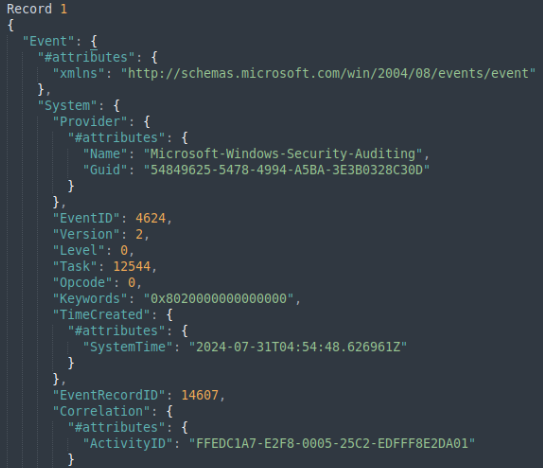
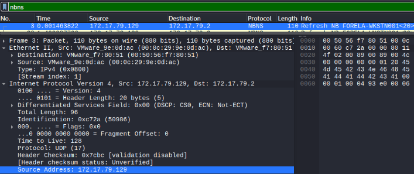
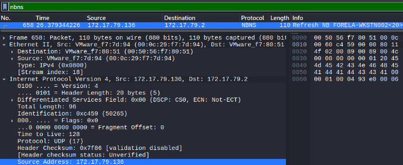
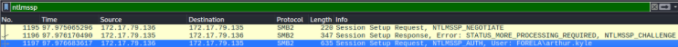
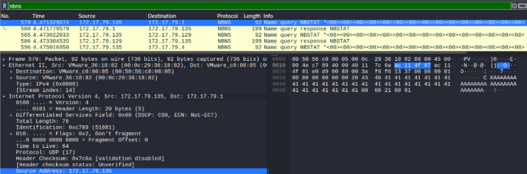
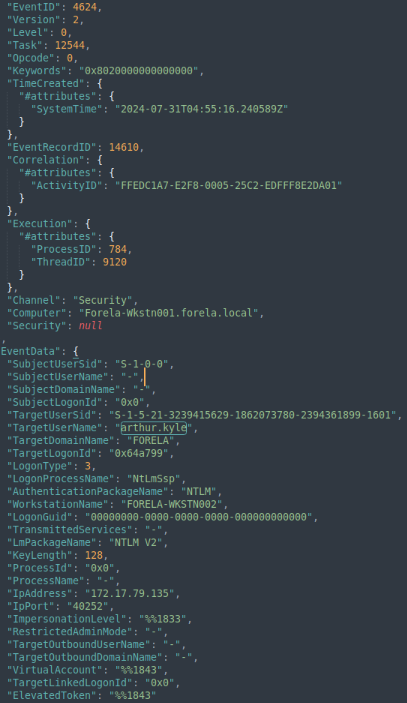
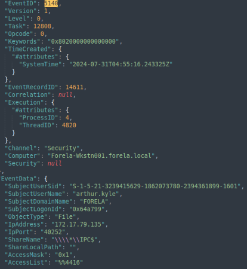

# Reaper

Find the Sherlock [here.](https://app.hackthebox.com/sherlocks/Reaper?tab=play_sherlock)

## Description
Our SIEM alerted us to a suspicious logon event which needs to be looked at immediately . The alert details were that the IP Address and the Source Workstation name were a mismatch .You are provided a network capture and event logs from the surrounding time around the incident timeframe. Correlate the given evidence and report back to your SOC Manager.

| Difficulty  | Category |
| ----------- | -------- |
| Very Easy   | DFIR     |

**Skills learned:**
* Network traffic analysis
* Windows Security log analysis

**File attachment(s):**
```text
Reaper.zip
├── Ntlmrelay.pcapng
└── Security.evtx
```

## Extra setup required for Linux machines
I completed this challenge on a Linux machine, so a bit of work is needed to be able to read the **Security.evtx** file. After some googling I found some writeups about using [this tool](https://github.com/omerbenamram/evtx/releases) to convert the evtx file into json format. I used **v0.9.0** specifically.

After downloading the tool, I renamed the executable to **evtx_dump** and ran it using the following command:
```
./evtx_dump -o json -f reaperSecurity.json /home/kali/Downloads/Reaper/Security.evtx
```
The reaperSecurity.json output file can be read with a text editor - I used [Sublime Text](https://www.sublimetext.com/).



Open the Ntlmrelay.pcapng file in Wireshark alongside the json file to begin answering the questions.

## Questions
**1. What is the IP Address for Forela-Wkstn001?**

Hint provided: Filter for nbns protocol to find the relevant IP Address.

Apply the Wireshark display filter `nbns` and look for packets where an IP address is returned for Forela-Wkstn001.



**Answer: 172.17.79.129**

**2. What is the IP Address for Forela-Wkstn002?**

Hint provided: Filter for nbns protocol to find the relevant IP Address.

Using the same method as in question 1, find the IP address returned for Forela-Wkstn002.



**Answer: 172.17.79.136**

**3. What is the username of the account whose hash was stolen by the attacker?**

Hint provided: Filter for ntlmssp protocol in wireshark OR Filter for 4624 event ID and Look for an odd looking logon event.

Apply the Wireshark display filter `ntlmssp` and packets containing Session Setup Requests & Responses can be found.



**Answer: arthur.kyle**

**4. What is the IP Address of Unknown Device used by the attacker to intercept credentials?**

Hint provided: Look for an IP Address that does not belong to any workstation but is involved in authentication flow for the victim user. Alternatively you can also filter for NBNS protocol and the device with no hostname is the device we are looking for. Another method is to look for the anomalous logon event and see the source IP Address.

Apply the Wireshark display filter `nbns` and look for packets with Name queries that do not include usernames. Then find the malicious IP address in the **Source Address** field.



**Answer: 172.17.79.135**

**5. What was the fileshare navigated by the victim user account?**

Hint provided: Filter for smb2 traffic in wireshark. Search for keywords "BAD_NETWORK_NAME" in packet details.

Apply the Wireshark display filter `smb2` and search for Tree Connect Request packets where the response is **Tree Connect Response, Error: STATUS_BAD_NETWORK_NAME**. These are requests where the file share doesn't exist or can't be accessed by the user.

**Answer: \\DC01\Trip**

**6. What is the source port used to logon to the target workstation using the compromised account?**

Hint provided: In provided Event logs, filter for event ID 4624 and look for an event where Security ID is NULL and logon type is 3.The logon process value will be NtlmSSP and authentication package value is NTLM. Then look for Source Port value in event details.

Open the reaperSecurity.json file and look for events with EventID of 4624 (looking for successful logons) where the user arthur.kyle authenticates. The port can be found in the **IpPort** field.



**Answer: 40252**

**7. What is the Logon ID for the malicious session?**

Hint provided: In the same event, look for LOGON ID Value

Examining the same log from question 6, look for the **TargetLogonId** field for the Logon ID.

**Answer: 0x64a799**

**8. The detection was based on the mismatch of hostname and the assigned IP Address.What is the workstation name and the source IP Address from which the malicious logon occurred?**

Hint provided: We already found all the IP Addresses for all the devices in the network. In the specified event ID 4624 , find both the workstation and IP from the network information section. The workstation name is false as its assigned IP will not be the one you see in the event log.

Looking back at the event log from questions 6 & 7, the hostname can be found in the **WorkstationName** field, and the IP address in the **IpAddress** field.

**Answer: FORELA-WKSTN002, 172.17.79.135**

**9. At what UTC time did the malicious logon happen?**

Hint provided: Look in details tab for the UTC Time

Looking back at the event log from the previous three questions, the timestamp can be found in the **SystemTime** field.

**Answer: 2024-07-31 04:55:16**

**10. What is the share Name accessed as part of the authentication process by the malicious tool used by the attacker?**

Hint provided: Look for event ID 5140 and see the share name accessed. We can corelate this event with the malicious session via the Logon ID we found before

In the reaperSecurity.json file, look for events with EventID of 5140 (looking for network share objects being accessed). There is only 1 finding - the network share name can be found in the **ShareName** field. Be careful of the extra \ character escaping.



**Answer: \\\\*\\IPC$**