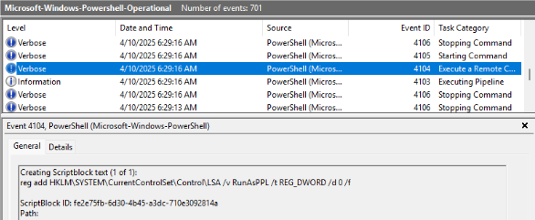
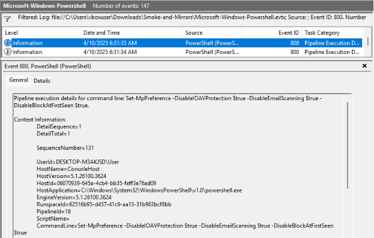
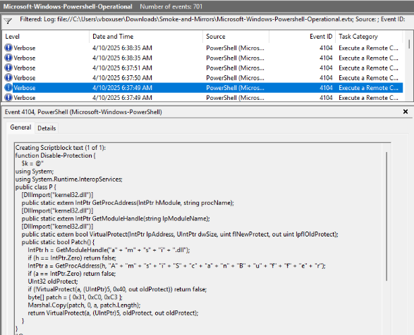
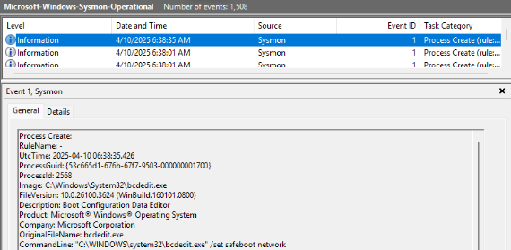
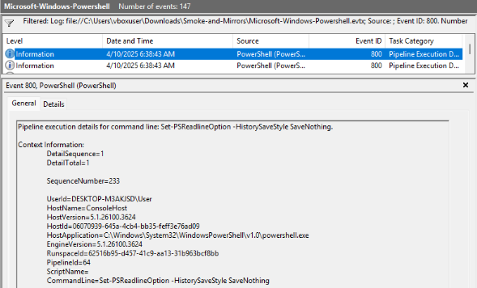

# Operation Blackout 2025: Smoke & Mirrors

Find the Sherlock [here.](https://app.hackthebox.com/sherlocks/Operation%2520Blackout%25202025%253A%2520Smoke%2520%2526%2520Mirrors?tab=play_sherlock)

|Difficulty |Category|
|:---------:|:------:|
| Very Easy |  DFIR  |

**Skills learned:**
* Analyzing Windows Event Viewer logs to search for malicious activity

## Description
Byte Doctor Reyes is investigating a stealthy post-breach attack where several expected security logs and Windows Defender alerts appear to be missing. He suspects the attacker employed defense evasion techniques to disable or manipulate security controls, significantly complicating detection efforts.

Using the exported event logs, your objective is to uncover how the attacker compromised the system's defenses to remain undetected.

**File attachment(s):**
```
Smoke-and-Mirrors.zip
└── Smoke-and-Mirrors
    ├── Microsoft-Windows-Powershell.evtx
    ├── Microsoft-Windows-Powershell-Operational.evtx
    └── Microsoft-Windows-Sysmon-Operational.evtx
```

## Questions
**1. The attacker disabled LSA protection on the compromised host by modifying a registry key. What is the full path of that registry key?**

We can find logs where Registry keys were edited by PowerShell in the *Powershell-Operational* file. Apply a filter for **Event ID 4104 (Execute a Remote Command)** and *Find* logs containing the term **LSA** to discover the full command and Registry key edited. 



The **reg add** command discovered targets the Local Security Authority (LSA) settings. We can tell this command disables LSA protection because the data value (/d) is **set to 0**.

**Answer: HKLM\System\CurrentControlSet\Control\LSA**

---

**2. Which PowerShell command did the attacker first execute to disable Windows Defender?**

The malicious PowerShell command can be found in the *Powershell* log file. Apply a filter for **Event ID 800 (Pipeline Execution Details)** and *Find* logs containing the term **disable** to discover the full command used. We also must find the **first** execution logged. 



The full command does the following:
* Turns off Input/Output Antivirus Protection (-DisableIOAVProtection)
* Stops Windows Defender from scanning incoming messages and attachments (-DisableEmailScanning)
* Turns off Block at First Seen, which inspects new files before allowing them to run

**Answer: Set-MpPreference -DisableIOAVProtection $true -DisableEmailScanning $true -DisableBlockAtFirstSeen $true**

---

**3. The attacker loaded an AMSI patch written in PowerShell. Which function in the DLL is being patched by the script to effectively disable AMSI?**

We can find the full malicious PowerShell script payload logged inside the *Powershell-Operational* file. Apply a filter for **Event ID 4104 (Execute a Remote Command)** and *Find* logs containing the term **dll**.



Examining the PowerShell script contents, we can see the **amsi.dll** being modified, and its function being patched in the line:
```powershell
GetProcAddress(h, "A" + "m" + "s" + "i" + "S" + "c" + "a" + "n" + "B" + "u" +"f" + "f" + "e" + "r");
```

**Answer: AmsiScanBuffer**

---

**4. Which command did the attacker use to restart the machine in Safe Mode?**

Research showed that the malicious command used to restart in safe Mode can be found in the *Sysmon-Operational* log file:
```
Attackers almost exclusively force a machine into Safe Mode via the Command Prompt or PowerShell using the native Windows Boot Configuration Data utility combined with a restart:
bcdedit /set {default} safeboot minimal

Look for Event ID 1 (Process Creation): Sysmon logs every spawned executable along with its full command line.
Filter query: Look for processes named bcdedit.exe, shutdown.exe, PowerShell.exe, or search the event details directly for the keyword safeboot.
```

Apply a filter for **Event ID 1 (Process Create)** and *Find* logs containing the term **safe**.



**Answer: bcdedit.exe /set safeboot network**

---

**5. Which PowerShell command did the attacker use to disable PowerShell command history logging?**

We can find the full malicious PowerShell command logged inside the *Powershell* file. Apply a filter for **Event ID 800 (Pipeline Execution Details)** and *Find* logs containing the term **history**.



The command's flag *-HistorySaveStyle* is set to **SaveNothing**, which permanently deletes all session commands instead of logging them.

**Answer: Set-PSReadlineOption -HistorySaveStyle SaveNothing**
